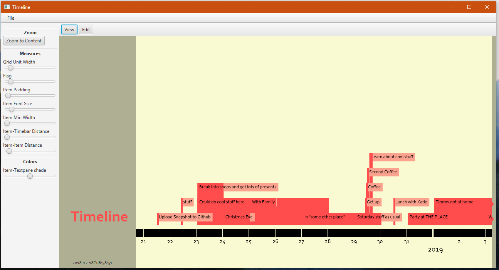
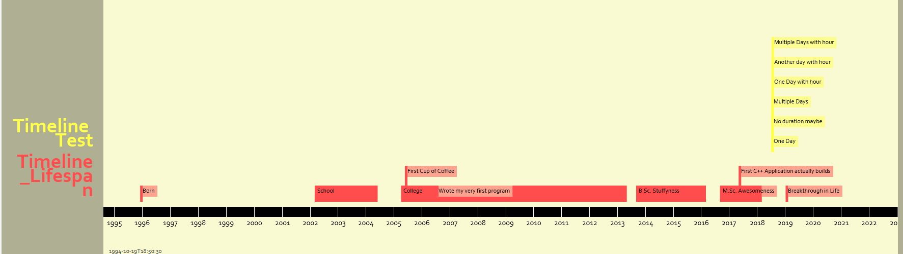

# TimelineFX

[Download latest executable version](http://michaelhochmuth.de/code/timelineFx/TimelineFx_0.0.1.jar).

## Intentions

TimelineFX is a Java application to browse, edit and filter events in a timeline-view, enabling better visualization of timespans in any scale. 
The intention is to provide an alternative to the normal ways in which calendars are displayed (tables containing a month/day/etc), that really incorporates the lengths of events and the time between them.

The application supports importing whole calendars in *.ical* Format (the result of e.g. exporting a Google calendar)

## Possible Use Cases

*	Create a Collection of events in one's life, sorting out unnecessary events to provide a clear chronological overview.
*	Visualize the times spent on certain activities / projects
*	Schedule things in the scale of years / days / seconds

## Current State

### Working Features

*	Import (multiple) *.ical* files
*	Drag, Zoom and Select specific time-frames to display
*	Time-bar with adaptive Units from Seconds to Decades

### Planned Features (Incomplete)

*	*Edit, Create, Delete* Items in the Program
*	*Filter* Items using certain rules (e.g. regex-match, duration etc) to only keep the important stuff
*	Different *Level of Detail* at different scales to not clutter the view (e.g. shorter items disappear, deciding the importance of items, etc) 
*	Combining with *Picture*-Folders - displaying the pictures at the time they were taken under the timebar for scrolling through

### Contribution

Until now this was just a project I did myself and until April 2019 I won't have much time to develop further but I *do* want to continue with it. If you like the project or the general idea and also haven't yet found something similar (or if you actually have) than I would love to hear from you!
